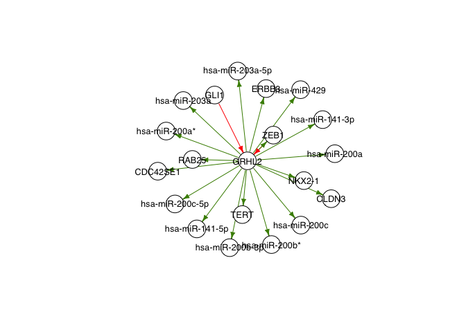
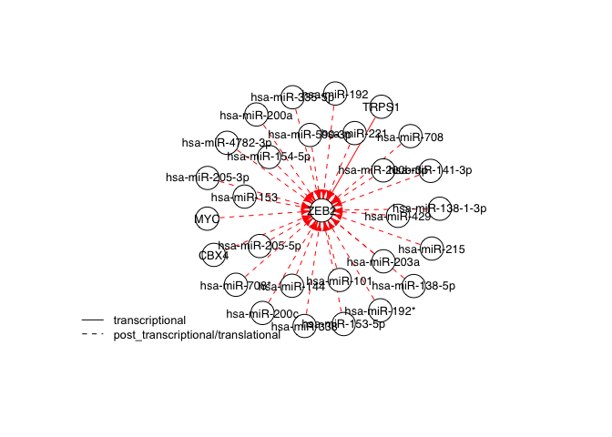
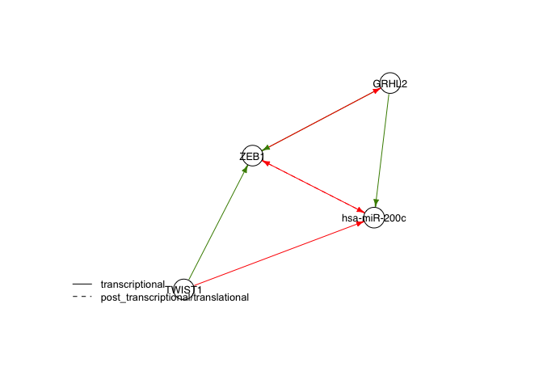
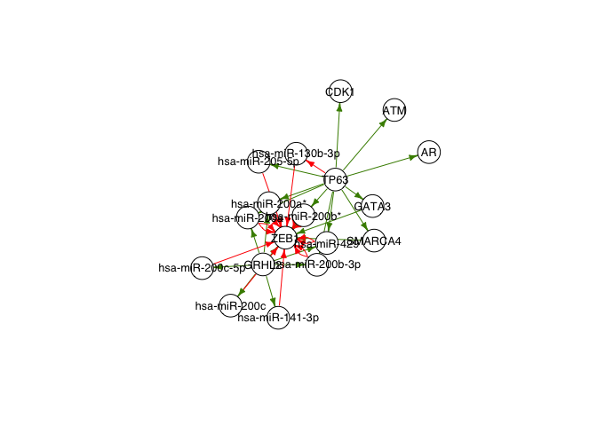

Omnipath for building Boolean Networks
================
2023-05-05

# Building a network using Omnipath

Import interactions from Omnipath

``` r
#Import libraries
library(OmnipathR)
source("./omnipath_myfunctions.R")

#Interactions with references from omnipath
interactions <- import_all_interactions()
interactions <- with_references(interactions)
```

## Get interactions of a specific gene

**search_gene**: Returns database with all the interactions of the input
gene, its sources and targets. Can be filtered by: “sources”,
“positive_sources”, “negative_sources”, “targets”, “positive_targets”,
“negative_targets”

``` r
gene="GRHL2"
search_gene(gene, interactions)
```

    ## $gene_name
    ## [1] "GRHL2"
    ## 
    ## $db
    ## # A tibble: 22 × 17
    ##    source target sourc…¹ targe…² is_di…³ is_st…⁴ is_in…⁵ conse…⁶ conse…⁷ conse…⁸
    ##    <chr>  <chr>  <chr>   <chr>     <dbl>   <dbl>   <dbl>   <dbl>   <dbl>   <dbl>
    ##  1 P37275 Q6ISB3 ZEB1    GRHL2         1       0       1       1       0       1
    ##  2 P08151 Q6ISB3 GLI1    GRHL2         1       0       1       1       0       1
    ##  3 P10275 Q6ISB3 AR      GRHL2         1       0       0       0       0       0
    ##  4 P03372 Q6ISB3 ESR1    GRHL2         1       0       0       0       0       0
    ##  5 Q6ISB3 O14746 GRHL2   TERT          1       1       0       1       1       0
    ##  6 Q6ISB3 Q9NRR8 GRHL2   CDC42S…       1       1       0       1       1       0
    ##  7 Q6ISB3 O15551 GRHL2   CLDN3         1       1       0       1       1       0
    ##  8 Q6ISB3 P57735 GRHL2   RAB25         1       1       0       1       1       0
    ##  9 Q6ISB3 P43699 GRHL2   NKX2-1        1       1       0       1       1       0
    ## 10 Q6ISB3 P21860 GRHL2   ERBB3         1       1       0       1       1       0
    ## # … with 12 more rows, 7 more variables: type <chr>, dorothea_level <chr>,
    ## #   sources <chr>, references <chr>, curation_effort <dbl>, n_references <chr>,
    ## #   n_resources <int>, and abbreviated variable names ¹​source_genesymbol,
    ## #   ²​target_genesymbol, ³​is_directed, ⁴​is_stimulation, ⁵​is_inhibition,
    ## #   ⁶​consensus_direction, ⁷​consensus_stimulation, ⁸​consensus_inhibition
    ## 
    ## $negative_sources
    ## $negative_sources$transcriptional
    ## [1] "ZEB1" "GLI1"
    ## 
    ## 
    ## $positive_targets
    ## $positive_targets$transcriptional
    ##  [1] "TERT"            "CDC42SE1"        "CLDN3"           "RAB25"          
    ##  [5] "NKX2-1"          "ERBB3"           "ZEB1"            "hsa-miR-141-5p" 
    ##  [9] "hsa-miR-141-3p"  "hsa-miR-200a*"   "hsa-miR-200a"    "hsa-miR-200b-3p"
    ## [13] "hsa-miR-200b*"   "hsa-miR-200c-5p" "hsa-miR-200c"    "hsa-miR-203a"   
    ## [17] "hsa-miR-203a-5p" "hsa-miR-429"

``` r
gene="CDH1"
search_gene(gene, interactions, "negative_sources")
```

    ## $negative_sources
    ## $negative_sources$transcriptional
    ##  [1] "SNAI1"   "WT1"     "ZEB1"    "SNAI2"   "ZEB2"    "DLX4"    "ZNF354C"
    ##  [8] "CTBP2"   "ZNF77"   "DNMT3A"  "DNMT3B"  "SMAD2"   "TWIST1"  "EZH2"   
    ## [15] "TBX3"    "TBX2"    "ID2"     "ID3"     "MTA2"    "SMAD3"   "MXD1"   
    ## [22] "SATB1"   "MBD2"    "ZHX2"    "MBD1"    "ID1"     "ZNF699"  "MTA1"   
    ## [29] "AR"      "HDAC1"   "HDAC3"   "HDGF"    "LMO2"    "SIRT1"   "CTBP1"  
    ## [36] "ATOH1"   "TBXT"   
    ## 
    ## $negative_sources$post_translational
    ##  [1] "TWIST1" "CSNK1E" "MAD2L2" "EZH2"   "PRKCD"  "HDAC2"  "HDAC1"  "CTBP1" 
    ##  [9] "ZEB1"   "SNAI1"  "ZEB2"   "SNAI2" 
    ## 
    ## $negative_sources$post_transcriptional
    ##  [1] "hsa-miR-155-5p"  "hsa-miR-155*"    "hsa-miR-200c-5p" "hsa-miR-200c"   
    ##  [5] "hsa-miR-205-5p"  "hsa-miR-205-3p"  "hsa-miR-221*"    "hsa-miR-221"    
    ##  [9] "hsa-miR-224-5p"  "hsa-miR-224-3p"  "hsa-miR-451b"    "hsa-miR-451"    
    ## [13] "hsa-miR-9"       "hsa-miR-92a"     "hsa-miR-199a"    "hsa-miR-544"    
    ## [17] "hsa-miR-888-5p"  "hsa-miR-421"     "hsa-miR-25-3p"   "hsa-miR-138-5p" 
    ## [21] "hsa-miR-23a"     "hsa-miR-30a"     "hsa-miR-204-5p"  "hsa-miR-9*"     
    ## [25] "hsa-miR-129-5p"  "hsa-miR-203a"

## Plot direct interactions of a gene

**plot_neighbours**:

``` r
plot_neighbours("GRHL2", interactions)
```

<!-- -->

``` r
plot_neighbours("ZEB2", interactions, type = 1, "negative_sources")
```

<!-- -->

## Get interactions for a set of genes

**get_gene_interaction**:

``` r
subset_nodes=c("GRHL2","ZEB1")
get_gene_interaction(subset_nodes, interactions)
```

    ## # A tibble: 2 × 17
    ##   source target source…¹ targe…² is_di…³ is_st…⁴ is_in…⁵ conse…⁶ conse…⁷ conse…⁸
    ##   <chr>  <chr>  <chr>    <chr>     <dbl>   <dbl>   <dbl>   <dbl>   <dbl>   <dbl>
    ## 1 Q6ISB3 P37275 GRHL2    ZEB1          1       1       0       0       0       0
    ## 2 P37275 Q6ISB3 ZEB1     GRHL2         1       0       1       1       0       1
    ## # … with 7 more variables: type <chr>, dorothea_level <chr>, sources <chr>,
    ## #   references <chr>, curation_effort <dbl>, n_references <chr>,
    ## #   n_resources <int>, and abbreviated variable names ¹​source_genesymbol,
    ## #   ²​target_genesymbol, ³​is_directed, ⁴​is_stimulation, ⁵​is_inhibition,
    ## #   ⁶​consensus_direction, ⁷​consensus_stimulation, ⁸​consensus_inhibition

## Plot direct interactions

Define genes to include in the network and plot direct interactions
between the genes with **plot_direct**. Option type=1 to include
interaction type in plot.

``` r
genes=c("GRHL2","ZEB1","hsa-miR-200c","TWIST1")
plot_direct(genes,interactions, type = 1)
```

<!-- -->

## Plot direct and indirect interactions

Plot direct and direct interactions from a set of genes to another with
**plot_paths**. Option type=1 to include interaction type in plot.

``` r
start=c("GRHL2","TP63")
end=c("ZEB1")
plot_paths(start,end,interactions)
```

<!-- -->

## Make a boolean model with just direct interactions

``` r
save_bnet(genes,genes, interactions,"model_direct.bnet",include_indirect=FALSE)
```

    ## [1] "No inputs found for TWIST1; added as input"

``` r
read.csv("model_direct.bnet")
```

    ##        targets                          factors
    ## 1        GRHL2                          !(ZEB1)
    ## 2         ZEB1 (GRHL2|TWIST1) & !(hsa-miR-200c)
    ## 3 hsa-miR-200c         (GRHL2) & !(ZEB1|TWIST1)
    ## 4       TWIST1                           TWIST1

## Make a boolean model with direct and indirect interactions

``` r
#genes=c("GRHL2","ZEB1","hsa-miR-200c")
genes=c("GRHL2","ZEB1","hsa-miR-200c","TP63","CDH1","TWIST1")
save_bnet(genes,genes, interactions,"model_indirect.bnet",include_indirect=TRUE)
```

    ## [1] "TWIST1 activates and represses hsa-miR-205-5p; only repression is incluced"
    ## [1] "ZEB1 activates and represses hsa-miR-203a; only repression is incluced"
    ## [1] "TP53 activates and represses TP63; only repression is incluced"
    ## [2] "MDM2 activates and represses TP63; only repression is incluced"
    ## [1] "No inputs found for YBX1; added as input"
    ## [1] "ZEB1 activates and represses CDH1; only repression is incluced"
    ## [1] "CDH1 activates and represses CTNNB1; only repression is incluced"
    ## [1] "TP63 activates and represses hsa-miR-155-5p; only repression is incluced"
    ## [1] "TWIST1 activates and represses hsa-miR-199a; only repression is incluced"

``` r
head(read.csv("model_indirect.bnet"))
```

    ##          targets
    ## 1             AR
    ## 2          GRHL2
    ## 3           ESR1
    ## 4           ZEB1
    ## 5           GLI1
    ## 6 hsa-miR-141-3p
    ##                                                                                                                                                                                                                  factors
    ## 1                                                                                                                                                                                                (TP63|TWIST1) & !(ZEB1)
    ## 2                                                                                                                                                                                                           !(ZEB1|GLI1)
    ## 3                                                                                                                                                                                                         !(ZEB1|TWIST1)
    ## 4 (TWIST1|GRHL2|GATA3|SMARCA4) & !(ZEB2|RELA|hsa-miR-200c|hsa-miR-141-3p|hsa-miR-200a|hsa-miR-200a*|hsa-miR-200b-3p|hsa-miR-200b*|hsa-miR-200c-5p|hsa-miR-429|hsa-miR-130b-3p|hsa-miR-205-5p|hsa-miR-10b|hsa-miR-223-3p)
    ## 5                                                                                                                                                                                                               (TWIST1)
    ## 6                                                                                                                                                                                                    (GRHL2) & !(TWIST1)
